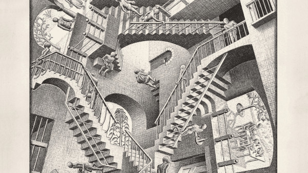
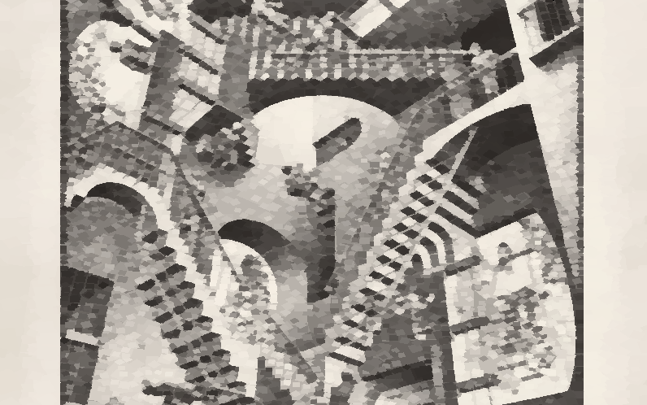

### Image evolution

An image stylization evolution algorithm.

Exemple on M.C. Escher's "Relativity"
| original image | stylized image |
| -- | -- |
|  |  |

CLI interface:

```
Usage: java -jar iev.java (...options) [target]
  target (File) - the input image
  --width (-w) <value>         - generated image width
  --height (-h) <value>        - generated image height
  --export-format (-e) <value> - intermediate images name, use {} to specify the generation (out_{}.png by default)
  --output (-o) <value>        - output file path (out.png by default)
  --generations (-g) <value>   - stop after N frames
  --no-display (-n)            - hide the window
  --verbose (-v)               - verbose output
  --export-every (-d) <value>  - export every other N intermediate images
  --resume <value>             - image to start from
  --sprite <value>             - sprite(s) to use, a white square by default
```